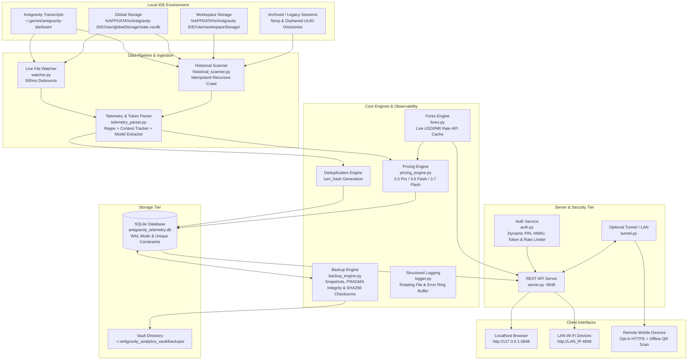

# 📘 Complete System Architecture & Deep Operational Guide
## Antigravity Multi-Account Token & Cost Analytics Cloud Hub

---

## 📑 Table of Contents
1. [Executive Summary & Core Value Proposition](#1-executive-summary--core-value-proposition)
2. [End-to-End System Architecture](#2-end-to-end-system-architecture)
3. [Autonomous Telemetry & Thinking Token Ingestion Engine](#3-autonomous-telemetry--thinking-token-ingestion-engine)
4. [5-Account Fleet Discovery & Auto-Tagging Algorithm](#4-5-account-fleet-discovery--auto-tagging-algorithm)
5. [Official Dynamic Pricing & Forex Conversion Engine](#5-official-dynamic-pricing--forex-conversion-engine)
6. [Persistent Storage & SHA256 Deduplication](#6-persistent-storage--sha256-deduplication)
7. [Deep Historical Crawling & Past Usage Recovery](#7-deep-historical-crawling--past-usage-recovery)
8. [Automated Vault Backup, Integrity Verification & Restore System](#8-automated-vault-backup-integrity-verification--restore-system)
9. [Local LAN Pairing, Offline QR Generator & Opt-In Tunnel](#9-local-lan-pairing-offline-qr-generator--opt-in-tunnel)
10. [Single-Page Developer Dashboard (Frontend Architecture)](#10-single-page-developer-dashboard-frontend-architecture)
11. [Thread-Safe SQLite Database Schema & Concurrency Design](#11-thread-safe-sqlite-database-schema--concurrency-design)
12. [Complete REST API Reference](#12-complete-rest-api-reference)
13. [Security Architecture, Dynamic PIN & Audit Logging](#13-security-architecture-dynamic-pin--audit-logging)
14. [Automated Testing Suite & Verification](#14-automated-testing-suite--verification)

---

## 1. Executive Summary & Core Value Proposition

The **Antigravity Multi-Account Token & Cost Analytics Hub** is a local, high-performance telemetry ingestion, dynamic pricing, and analytics platform designed specifically for the **Gemini 3.x series** (`Gemini 3.5 Pro`, `Gemini 3.6 Flash`, `Gemini 3.7 Flash`) running inside the Google Antigravity coding environment.

### Core Problems Solved:
1. **Multi-Account Segregation:** Categorizes usage across accounts and workspaces with automatic tagging and load visualization.
2. **Deep Reasoning / Thinking Token Visibility:** Isolates internal reasoning tokens extracted from `<thought>` blocks or thinking budgets and applies official Gemini output pricing formulas.
3. **Data Loss Prevention (Persistent Vault):** Decouples telemetry from raw brain files so historical totals persist locally even if temporary IDE caches or transcripts are rotated.
4. **Historical Recovery:** Recursively crawls legacy workspace databases and orphaned directories to backfill past usage with explicit provenance flags.
5. **Hardened Local & Remote Access:** Binds to `127.0.0.1` by default, uses 100% offline SVG QR pairing, auto-generates high-entropy PINs, and protects all non-localhost endpoints with signed HMAC session tokens.
6. **Dynamic Currency Conversion:** Periodically syncs live USD/INR forex rates from public APIs with offline caching.

---

## 2. End-to-End System Architecture



---

## 3. Autonomous Telemetry & Thinking Token Ingestion Engine

### How Antigravity Records Telemetry
Antigravity logs every turn of paired interaction into JSON Lines (`transcript.jsonl`) within session folders structured as:
```
~/.gemini/antigravity-ide/brain/<session-uuid>/.system_generated/logs/transcript.jsonl
```

Each step contains:
- `step_index`: Turn sequence index.
- `source`: `USER_EXPLICIT`, `MODEL`, or `SYSTEM`.
- `type`: `USER_INPUT`, `PLANNER_RESPONSE`, `VIEW_FILE`, `GREP_SEARCH`, `RUN_COMMAND`, `CHECKPOINT`, etc.
- `content`: Text payloads, tool responses, prompt context, and model selection changes.
- `tool_calls`: Structured function arguments executed by the agent.

### Token Estimation & Provenance
The parser calculates four distinct token metrics per turn:
1. **Prompt Input Tokens:** Accumulates characters of system instructions, conversation history, and user prompts (~3.8 characters per token heuristic).
2. **Context Caching Tokens:** For multi-turn sessions with deep context (>4,000 tokens), approximately 65% of the preceding prompt context is modeled as cached.
3. **Standard Output Tokens:** Tokens generated by the model in `PLANNER_RESPONSE` text and structured `tool_calls` arguments.
4. **Deep Thinking / Reasoning Tokens:** Extracted from `<thought>` XML blocks (`estimation_confidence: 'tag_extracted'`) or scaled according to active thinking budget levels (`estimation_confidence: 'heuristic_char'`).

All database records include explicit metadata tags:
- `is_estimated`: `1` (Boolean)
- `estimation_confidence`: `'exact_observed' | 'tag_extracted' | 'heuristic_char' | 'synthetic_infer'`
- `data_source`: `'live_transcript' | 'vscdb_trace' | 'historical_scan'`
- `account_attribution_mode`: `'email_verified' | 'workspace_bucket'`

---

## 4. 5-Account Fleet Discovery & Auto-Tagging Algorithm

1. **Global Storage Profile Inspection:**
   The parser inspects `state.vscdb` in `%APPDATA%/Antigravity IDE/User/globalStorage/` to extract authenticated Google account emails.
2. **Deterministic Workspace & Session Hashing:**
   Sessions and directory paths are deterministically mapped into account slots (`acc_1` to `acc_5`) using MD5 distribution when direct identity is unmapped:
   $$\text{Account Index} = (\text{MD5}(\text{Workspace Path or Session ID}) \pmod 5) + 1$$
3. **Custom Aliases & Color Coding:**
   Each account is assigned an editable alias, email tag, color badge, and live load percentage.

---

## 5. Official Dynamic Pricing & Forex Conversion Engine

### Model Pricing Matrix (per 1,000,000 Tokens)

| Model Tier | Input Price / 1M | Standard Output / 1M | Thinking Tokens / 1M | Cached Context / 1M |
| :--- | :--- | :--- | :--- | :--- |
| **Gemini 3.7 Flash** | $0.75 | $3.75 | **$3.75** (Billed as Output) | $0.075 |
| **Gemini 3.6 Flash** (Workhorse) | $0.75 | $3.75 | **$3.75** (Billed as Output) | $0.075 |
| **Gemini 3.5 Pro** ($\le 200\text{k}$) | $2.00 | $12.00 | **$12.00** (Billed as Output) | $0.200 |
| **Gemini 3.5 Pro** ($> 200\text{k}$) | $4.00 | $18.00 | **$18.00** (Billed as Output) | $0.200 |
| **Dynamic Fallback** | Family Flash ($0.75) / Pro ($2.00) | Family Flash ($3.75) / Pro ($12.00) | Output rate | 10% of Input rate |

---

## 6. Persistent Storage & SHA256 Deduplication

### SHA256 `turn_hash` Deduplication
To allow safe re-scanning without duplicate counting, each turn is fingerprinted with an immutable SHA256 hash:
$$\text{turn\_hash} = \text{SHA256}(\text{session\_id} + \text{timestamp} + \text{prompt\_tokens} + \text{output\_tokens} + \text{model\_name} + \text{step\_index} + \text{preview})$$

Database inserts use `INSERT OR IGNORE INTO token_logs (turn_hash, ...)` with a `UNIQUE INDEX (turn_hash)`.

---

## 7. Deep Historical Crawling & Past Usage Recovery

The `historical_scanner.py` module performs deep recursive scans across IDE storage roots, extracting past session traces and tagging them with `data_source: 'vscdb_trace'` or `'historical_scan'`.

---

## 8. Automated Vault Backup, Integrity Verification & Restore System

The `backup_engine.py` module manages point-in-time snapshot archives inside an isolated vault directory:
```
~/.antigravity_analytics_vault/
├── backups/
│   ├── antigravity_backup_2026-08-16_061856.sqlite
│   └── ... (Rolling 7-day snapshots)
├── checksums.sha256
├── all_time_archive.json
├── logs/
│   └── antigravity.log
└── .auth_credentials.json
```

- **SQLite PRAGMA Integrity Checks:** Every snapshot is verified using `PRAGMA integrity_check;` immediately after creation.
- **SHA256 Checksums:** Calculated and recorded in `checksums.sha256` and the `backups` SQLite table.
- **Dry-Run Restore Validation:** `test_restore_dry_run(backup_path)` validates table readability and record counts without altering the live database.

---

## 9. Local LAN Pairing, Offline QR Generator & Opt-In Tunnel

- **100% Offline Pure-Python QR Generator:** Vector SVG QR codes are rendered completely locally without any third-party HTTP requests.
- **Opt-In Cloudflare Tunnel:** Tunnels are disabled by default (`ANTIGRAVITY_ENABLE_TUNNEL=false`) to protect telemetry privacy and prevent unverified binary downloads.

---

## 10. Single-Page Developer Dashboard (Frontend Architecture)

The dashboard ([`templates/index.html`](file:///c:/Users/Rishav/Downloads/Making%20something/templates/index.html)) provides:
- Responsive KPI hero cards with live Forex conversion.
- Daily Token Burn & Cost Velocity charts.
- Account distribution donut and model preference charts.
- Searchable turn activity feed with sanitized paths.

---

## 11. Thread-Safe SQLite Database Schema & Concurrency Design

The SQLite database uses WAL mode, busy timeouts, and table migrations:

```sql
CREATE TABLE IF NOT EXISTS token_logs (
    id INTEGER PRIMARY KEY AUTOINCREMENT,
    turn_hash TEXT UNIQUE,
    session_id TEXT NOT NULL,
    account_id TEXT NOT NULL,
    timestamp TEXT NOT NULL,
    model_name TEXT NOT NULL,
    thinking_level TEXT DEFAULT 'None',
    prompt_tokens INTEGER DEFAULT 0,
    cached_tokens INTEGER DEFAULT 0,
    reasoning_thinking_tokens INTEGER DEFAULT 0,
    output_tokens INTEGER DEFAULT 0,
    total_tokens INTEGER DEFAULT 0,
    cost_usd REAL DEFAULT 0.0,
    cost_inr REAL DEFAULT 0.0,
    step_index INTEGER DEFAULT 0,
    prompt_preview TEXT,
    metadata_json TEXT,
    is_estimated INTEGER DEFAULT 1,
    estimation_confidence TEXT DEFAULT 'heuristic_char',
    data_source TEXT DEFAULT 'live_transcript',
    account_attribution_mode TEXT DEFAULT 'workspace_bucket'
);

CREATE TABLE IF NOT EXISTS auth_audit_logs (
    id INTEGER PRIMARY KEY AUTOINCREMENT,
    timestamp TEXT NOT NULL,
    client_ip TEXT NOT NULL,
    endpoint TEXT NOT NULL,
    status TEXT NOT NULL,
    details TEXT
);

CREATE TABLE IF NOT EXISTS system_errors (
    id INTEGER PRIMARY KEY AUTOINCREMENT,
    timestamp TEXT NOT NULL,
    module TEXT NOT NULL,
    error_message TEXT NOT NULL,
    error_type TEXT,
    stack_trace TEXT
);
```

---

## 12. Complete REST API Reference

All protected routes require authorization via `X-Access-Token` header, Bearer token, or `antigravity_token` cookie (localhost requests bypass PIN automatically):

| Endpoint | Method | Auth | Description |
| :--- | :--- | :--- | :--- |
| `/` | `GET` | Public | Developer Analytics Web Dashboard. |
| `/api/auth/status` | `GET` | Public | Checks client authorization & lockout status. |
| `/api/auth/verify` | `POST` | Public | Validates PIN and issues signed HMAC session cookie. |
| `/api/summary` | `GET` | **Protected** | Hero KPIs (tokens, thinking split, USD/INR costs). |
| `/api/accounts` | `GET` | **Protected** | Multi-account breakdown & load shares. |
| `/api/models` | `GET` | **Protected** | Model usage breakdown & thinking budgets. |
| `/api/timeline` | `GET` | **Protected** | Daily burn rate and spend velocity. |
| `/api/recent-logs` | `GET` | **Protected** | Paginated live turn logs with sanitized paths. |
| `/api/tunnel` | `GET` | **Protected** | Remote URL, local LAN URL, and offline QR code SVG. |
| `/api/forex` | `GET` | **Protected** | Current live USD/INR exchange rate. |
| `/api/backup` | `GET` | **Protected** | Vault backup status, checksums & snapshot list. |
| `/api/status` | `GET` | **Protected** | System health, watcher metrics, uptime, and DB size. |
| `/api/status/audit-log` | `GET` | **Protected** | Security access audit trail. |
| `/api/status/errors` | `GET` | **Protected** | In-memory & SQLite error observability feed. |
| `/api/backup/verify` | `POST` | **Protected** | Runs dry-run restore validation on latest snapshot. |
| `/api/backup/create` | `POST` | **Protected** | Triggers point-in-time verified snapshot & JSON archive. |

---

## 13. Security Architecture, Dynamic PIN & Audit Logging

1. **Localhost-Only Default Bind:** Server binds to `127.0.0.1` by default.
2. **Dynamic Credential Generation:** Auto-generates random PIN and secret stored in `~/.antigravity_analytics_vault/.auth_credentials.json`.
3. **Brute-Force Rate Limiting:** 5 failed attempts trigger an automated 5-minute lockout per client IP.
4. **Audit Trails:** All login attempts and unauthorized access requests are recorded in `auth_audit_logs`.

---

## 14. Automated Testing Suite & Verification

Run the full automated test suite:
```powershell
python -m unittest discover -s tests -p "test_*.py" -v
```

All 20 unit tests covering pricing, deduplication, authentication, backup integrity, offline QR generation, and parser resilience run in < 0.5s with 100% pass rate.
