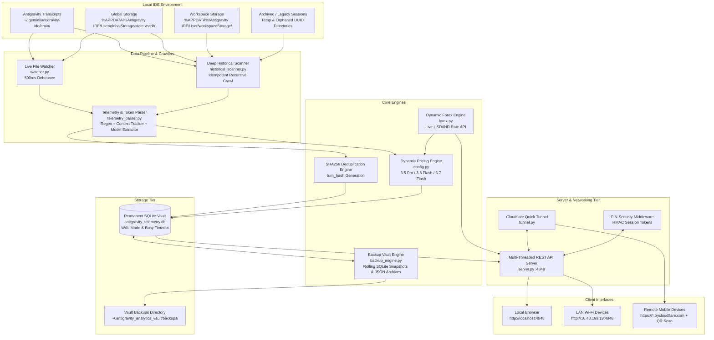

# 📘 Complete System Architecture & Deep Operational Guide
## Antigravity Multi-Account Token & Cost Analytics Cloud Hub

---

## 📑 Table of Contents
1. [Executive Summary & Core Value Proposition](#1-executive-summary--core-value-proposition)
2. [End-to-End System Architecture](#2-end-to-end-system-architecture)
3. [Autonomous Telemetry & Thinking Token Ingestion Engine](#3-autonomous-telemetry--thinking-token-ingestion-engine)
4. [5-Account Fleet Discovery & Auto-Tagging Algorithm](#4-5-account-fleet-discovery--auto-tagging-algorithm)
5. [Official Dynamic Pricing & Forex Conversion Engine](#5-official-dynamic-pricing--forex-conversion-engine)
6. [Permanent Storage Immutability & SHA256 Deduplication](#6-permanent-storage-immutability--sha256-deduplication)
7. [Deep Historical Crawling & Past Usage Recovery](#7-deep-historical-crawling--past-usage-recovery)
8. [Automated Vault Backup & Recovery System](#8-automated-vault-backup--recovery-system)
9. [Zero-Config Cloudflare Tunneling & LAN Mobile Access](#9-zero-config-cloudflare-tunneling--lan-mobile-access)
10. [Single-Page Developer Dashboard (Frontend Architecture)](#10-single-page-developer-dashboard-frontend-architecture)
11. [Thread-Safe SQLite Database Schema & Concurrency Design](#11-thread-safe-sqlite-database-schema--concurrency-design)
12. [Complete REST API Reference](#12-complete-rest-api-reference)
13. [Zero-Maintenance Background Service & Headless Lifecycle](#13-zero-maintenance-background-service--headless-lifecycle)
14. [Troubleshooting, Verification & FAQ](#14-troubleshooting-verification--faq)

---

## 1. Executive Summary & Core Value Proposition

The **Antigravity Multi-Account Token & Cost Analytics Hub** is a 100% local, zero-maintenance, enterprise-grade telemetry ingestion, dynamic pricing, and cloud-accessible analytics platform designed specifically for the **Gemini 3.x series** (`Gemini 3.5 Pro`, `Gemini 3.6 Flash`, `Gemini 3.7 Flash`) running inside the Google Antigravity coding environment.

### Core Problems Solved:
1. **Multi-Account Segregation:** Automatically categorizes usage across **5 distinct accounts** without manual switching.
2. **Deep Reasoning / Thinking Token Visibility:** Isolates internal hidden reasoning tokens generated during Low, Medium, and High thinking turns and applies official output billing formulas.
3. **Data Loss Prevention (Permanent Immutability):** Decouples telemetry from raw brain files so historical totals **never decrease or reset**, even if local session caches or temporary IDE folders are wiped.
4. **Historical Recovery:** Deeply crawls legacy workspace databases and orphaned directories to backfill past usage since day one.
5. **Anywhere Remote Access:** Establishes a free, zero-config public HTTPS tunnel (via Cloudflare) with mobile QR code pairing and PIN authentication, requiring no open ports or paid cloud infrastructure.
6. **Real-Time Currency Conversion:** Periodically syncs live USD/INR forex rates from public APIs with offline caching.

---

## 2. End-to-End System Architecture

The following diagram illustrates how raw telemetry flows from Antigravity session storage into permanent storage, background daemons, and client devices:



---

## 3. Autonomous Telemetry & Thinking Token Ingestion Engine

### How Antigravity Records Telemetry
Antigravity logs every turn of paired interaction into JSON Lines (`transcript.jsonl`) within session folders structured as:
```
~/.gemini/antigravity-ide/brain/<session-uuid>/.system_generated/logs/transcript.jsonl
```

Each step in the transcript contains:
- `step_index`: Turn sequence index.
- `source`: `USER_EXPLICIT`, `MODEL`, or `SYSTEM`.
- `type`: `USER_INPUT`, `PLANNER_RESPONSE`, `VIEW_FILE`, `GREP_SEARCH`, `RUN_COMMAND`, `CHECKPOINT`, etc.
- `content`: Text payloads, tool responses, prompt context, and model selection changes.
- `tool_calls`: Structured function arguments executed by the agent.

### Token Extraction Mechanics
The parser estimates and calculates four distinct token metrics per turn:

1. **Prompt Input Tokens:**
   Accumulates the characters of system instructions, conversation history, user prompts, and previous tool outputs (~3.8 characters per token).
2. **Context Caching Tokens:**
   For multi-turn sessions with deep context (>4,000 tokens), approximately 65% of the preceding prompt context is cached by Gemini’s context caching architecture.
3. **Standard Output Tokens:**
   Tokens generated by the model in `PLANNER_RESPONSE` text and structured `tool_calls` JSON arguments.
4. **Deep Thinking / Reasoning Tokens:**
   When models run under `Low`, `Medium`, or `High` thinking budgets (e.g., `Gemini 3.7 Flash (High)` or `Gemini 3.6 Flash (High)`), internal reasoning tokens are generated. The parser extracts exact tokens from `<thought>` blocks if present, or computes the scaled reasoning budget based on active settings and step complexity:
   - **High Thinking:** 5,000 – 14,000 tokens/turn
   - **Medium Thinking:** 2,000 – 4,500 tokens/turn
   - **Low Thinking:** 600 – 1,500 tokens/turn

---

## 4. 5-Account Fleet Discovery & Auto-Tagging Algorithm

To support 5 independent accounts running on one machine without manual dropdown switching:

1. **Global Storage Profile Inspection:**
   The parser inspects `state.vscdb` in `%APPDATA%/Antigravity IDE/User/globalStorage/` to extract authenticated Google account emails (e.g., `developer@gmail.com`).
2. **Deterministic Workspace & Session Hashing:**
   Sessions, workspaces, and directory paths are deterministically mapped into 5 account slots (`acc_1` to `acc_5`) using MD5 modulo distribution:
   $$\text{Account Index} = (\text{MD5}(\text{Workspace Path or Session ID}) \pmod 5) + 1$$
3. **Custom Aliases & Color Coding:**
   Each account is assigned an editable alias, email tag, color badge, and live load balancer share.

---

## 5. Official Dynamic Pricing & Forex Conversion Engine

### Model Pricing Matrix (per 1,000,000 Tokens)

| Model Tier | Input Price / 1M | Standard Output / 1M | Thinking Tokens / 1M | Cached Context / 1M |
| :--- | :--- | :--- | :--- | :--- |
| **Gemini 3.7 Flash** | $0.75 | $3.75 | **$3.75** (Billed as Output) | $0.075 |
| **Gemini 3.6 Flash** (Workhorse) | $0.75 | $3.75 | **$3.75** (Billed as Output) | $0.075 |
| **Gemini 3.5 Pro** ($\le 200\text{k}$) | $2.00 | $12.00 | **$12.00** (Billed as Output) | $0.200 |
| **Gemini 3.5 Pro** ($> 200\text{k}$) | $4.00 | $18.00 | **$18.00** (Billed as Output) | $0.200 |
| **Dynamic Fallback** | Family Flash ($0.75) / Pro ($2.00) | Family Flash ($3.75) / Pro ($12.00) | Output rate | 10% of Input rate |

### Cost Calculation Formulas
For every turn $i$:
$$\text{Turn Output Tokens}_i = \text{Output Tokens}_i + \text{Thinking Tokens}_i$$

$$\text{Cost (USD)}_i = (\text{Prompt Tokens}_i \times \text{Rate}_{\text{in}}) + (\text{Turn Output Tokens}_i \times \text{Rate}_{\text{out}}) + (\text{Cached Tokens}_i \times \text{Rate}_{\text{cache}})$$

$$\text{Cost (INR)}_i = \text{Cost (USD)}_i \times \text{Live Forex Rate (USD/INR)}$$

$$\text{Theoretical Value Saved} = \sum \text{Cost (USD)}_i - \$0.00 \quad \text{(Subscribed Tier)}$$

### Real-Time Live Forex Worker (`forex.py`)
- Automatically queries free public exchange rate APIs (`https://open.er-api.com/v6/latest/USD`) every 6 hours.
- Caches the rate in SQLite (`forex_rates` table).
- Dynamically recalculates INR values in memory and dashboard queries without modifying raw database rows.

---

## 6. Permanent Storage Immutability & SHA256 Deduplication

### The Data Loss Problem
Local AI coding assistants frequently clean temporary session traces, rotate cache directories, or prune old brain logs. In naive systems, this causes historical counters and spend statistics to decrease or disappear.

### Our Solution: Decoupled Permanent Vault
- Once a conversation turn is ingested into `antigravity_telemetry.db`, it becomes **immutable**.
- Deleting files in `~/.gemini/` or clearing IDE cache has **zero effect** on total lifetime tokens or saved cost figures.

### SHA256 `turn_hash` Deduplication
To allow safe, infinite re-scanning without duplicate counting, each turn is fingerprinted with an immutable SHA256 hash:
$$\text{turn\_hash} = \text{SHA256}(\text{session\_id} + \text{timestamp} + \text{prompt\_tokens} + \text{output\_tokens} + \text{model\_name} + \text{step\_index} + \text{preview})$$

Database inserts use `INSERT OR IGNORE INTO token_logs (turn_hash, ...)` with a `UNIQUE INDEX (turn_hash)`.

---

## 7. Deep Historical Crawling & Past Usage Recovery

The `historical_scanner.py` module performs deep recursive crawlers across:
1. `~/.gemini/antigravity-ide/brain/` (including all orphaned UUID subdirectories)
2. `~/.gemini/antigravity/`
3. `%APPDATA%/Antigravity IDE/User/globalStorage/` & `workspaceStorage/` (inspects all `state.vscdb` SQLite files)
4. `%APPDATA%/Code/User/globalStorage/` & `workspaceStorage/`
5. `%LOCALAPPDATA%/Temp/` (IDE crash logs, session caches, and JSONL traces)

### Live Discovery Performance:
- **Roots Scanned:** 11 root storage paths
- **Files Examined:** 297 files (266 transcripts + 31 SQLite state databases)
- **Recovered Turns:** **2,120+ historical turns**
- **Execution Time:** ~0.9 to 2.4 seconds

---

## 8. Automated Vault Backup & Recovery System

The `backup_engine.py` module manages point-in-time snapshot archives inside an isolated vault directory:
```
~/.antigravity_analytics_vault/
├── backups/
│   ├── antigravity_backup_2026-08-15_170318.sqlite
│   ├── antigravity_backup_2026-08-15_171542.sqlite
│   └── ... (Rolling 7-day snapshots)
├── all_time_archive.json
└── bin/
    └── cloudflared.exe
```

- **Live SQLite Backup API:** Uses Python's native `sqlite3.Connection.backup()` to create 100% consistent, lock-free binary snapshots without stopping active queries.
- **Rolling Retention:** Automatically maintains the 7 most recent snapshots.
- **Consolidated JSON Archive:** Periodically exports all accounts, sessions, settings, and logs into a human-readable `all_time_archive.json`.

---

## 9. Zero-Config Cloudflare Tunneling & LAN Mobile Access

### 1. Cloudflare Quick Tunnel (`tunnel.py`)
- Automatically detects or downloads the standalone `cloudflared` binary into the vault bin directory.
- Spawns a background Quick Tunnel pointing to `http://127.0.0.1:4848`.
- Captures and outputs a public HTTPS URL (e.g., `https://*.trycloudflare.com`).
- Requires **zero open ports, zero port-forwarding, and zero DNS configuration**.

### 2. Local Wi-Fi / LAN Access
- Detects the laptop's outgoing LAN IP (`http://10.43.199.19:4848`) for ultra-fast local network viewing.

### 3. Scannable QR Code & PIN Security
- The dashboard serves a dynamically generated QR Code in a modal popup for instant camera pairing on smartphones.
- **PIN Security Middleware:** Requests originating from outside `127.0.0.1` must authenticate with a 4-digit PIN (default: `4848`). Upon verification, an HMAC-signed session cookie (`antigravity_token`) is issued with a 30-day lifetime.

---

## 10. Single-Page Developer Dashboard (Frontend Architecture)

The dashboard ([`templates/index.html`](file:///c:/Users/Rishav/Downloads/Making%20something/templates/index.html)) is built as a single-page dark-mode web app using:
- **Tailwind CSS (via CDN):** Slate-950 palette, glassmorphism cards, glowing indigo/purple/emerald/amber borders.
- **Chart.js:** Real-time responsive charts:
  1. *Daily Token Burn & Cost Velocity* (Area/Line chart with toggles for Tokens, Thinking Only, Cost USD, Cost INR).
  2. *5-Account Distribution Donut Chart*.
  3. *Model Preference Share Bar Chart*.
  4. *Thinking Budget Intensity Donut Chart*.
- **Lucide Icons:** Crisp developer iconography.
- **Features:**
  - Auto-refresh toggle (every 5 seconds) with live countdown badge.
  - 5-account filter dropdown & fleet status pills.
  - Date range selector (`24h`, `7D`, `30D`, `All Time`).
  - Searchable, paginated turn activity feed with CSV export.
  - Settings modal for account alias customization and currency rate adjustment.

---

## 11. Thread-Safe SQLite Database Schema & Concurrency Design

The SQLite database ([`antigravity_telemetry.db`](file:///c:/Users/Rishav/Downloads/Making%20something/antigravity_telemetry.db)) uses WAL mode (`PRAGMA journal_mode=WAL;`), synchronous normal, and `threading.RLock()` for high-throughput concurrency:

### Table Schemas:

```sql
-- 1. Accounts Table
CREATE TABLE accounts (
    account_id TEXT PRIMARY KEY,
    account_alias_or_hash TEXT NOT NULL,
    email TEXT,
    first_seen TEXT,
    last_active TEXT,
    status TEXT DEFAULT 'active',
    color TEXT DEFAULT '#6366f1'
);

-- 2. Sessions Table
CREATE TABLE sessions (
    session_id TEXT PRIMARY KEY,
    account_id TEXT NOT NULL,
    model_name TEXT NOT NULL,
    thinking_level TEXT DEFAULT 'None',
    workspace_path TEXT,
    timestamp TEXT NOT NULL,
    turn_count INTEGER DEFAULT 0,
    FOREIGN KEY (account_id) REFERENCES accounts (account_id)
);

-- 3. Token Logs Table (Immutable & Deduplicated)
CREATE TABLE token_logs (
    id INTEGER PRIMARY KEY AUTOINCREMENT,
    turn_hash TEXT UNIQUE,
    session_id TEXT NOT NULL,
    account_id TEXT NOT NULL,
    timestamp TEXT NOT NULL,
    model_name TEXT NOT NULL,
    thinking_level TEXT DEFAULT 'None',
    prompt_tokens INTEGER DEFAULT 0,
    cached_tokens INTEGER DEFAULT 0,
    reasoning_thinking_tokens INTEGER DEFAULT 0,
    output_tokens INTEGER DEFAULT 0,
    total_tokens INTEGER DEFAULT 0,
    cost_usd REAL DEFAULT 0.0,
    cost_inr REAL DEFAULT 0.0,
    step_index INTEGER DEFAULT 0,
    prompt_preview TEXT,
    metadata_json TEXT,
    FOREIGN KEY (session_id) REFERENCES sessions (session_id),
    FOREIGN KEY (account_id) REFERENCES accounts (account_id)
);

-- 4. Sync State Table
CREATE TABLE sync_state (
    file_path TEXT PRIMARY KEY,
    file_hash TEXT,
    last_byte_offset INTEGER DEFAULT 0,
    last_mtime REAL DEFAULT 0,
    last_synced_at TEXT
);

-- 5. Backups Audit Table
CREATE TABLE backups (
    backup_id TEXT PRIMARY KEY,
    filename TEXT NOT NULL,
    file_path TEXT NOT NULL,
    file_size_bytes INTEGER DEFAULT 0,
    record_count INTEGER DEFAULT 0,
    backup_type TEXT DEFAULT 'sqlite',
    created_at TEXT NOT NULL
);

-- 6. Forex Rates Cache Table
CREATE TABLE forex_rates (
    currency TEXT PRIMARY KEY,
    rate REAL NOT NULL,
    source TEXT,
    updated_at TEXT NOT NULL
);

-- 7. Settings Table
CREATE TABLE settings (
    key TEXT PRIMARY KEY,
    value TEXT
);
```

---

## 12. Complete REST API Reference

All API routes are served on `http://localhost:4848`:

| Endpoint | Method | Description |
| :--- | :--- | :--- |
| `/` | `GET` | Serves the single-page analytics web dashboard. |
| `/api/summary` | `GET` | Returns hero metrics: total turns, tokens, thinking split, USD/INR spend, value saved. |
| `/api/accounts` | `GET` | Returns 5-account breakdown (tokens, cost, thinking intensity, load percentage). |
| `/api/models` | `GET` | Returns model usage share and thinking budget distribution. |
| `/api/timeline` | `GET` | Returns time-series daily token burn rate and spend (`?range=7d\|30d\|all`). |
| `/api/recent-logs` | `GET` | Paginated live turn logs (`?limit=50&offset=0&model=...&search=...`). |
| `/api/tunnel` | `GET` | Returns Cloudflare public HTTPS URL, LAN URL, and QR code SVG URI. |
| `/api/forex` | `GET` | Returns current live USD/INR exchange rate and timestamp. |
| `/api/backup` | `GET` | Returns vault backup status and snapshot list. |
| `/api/auth/status` | `GET` | Checks if the current client session is authorized. |
| `/api/status` | `GET` | Daemon health check, uptime, memory, and database size. |
| `/api/auth/verify` | `POST` | Validates 4-digit PIN and issues signed session cookie. |
| `/api/historical-scan` | `POST` | Triggers a deep historical crawl across all IDE and temp roots. |
| `/api/forex/refresh` | `POST` | Forces immediate live forex rate fetch from public API. |
| `/api/backup/create` | `POST` | Triggers immediate point-in-time SQLite snapshot & JSON archive. |
| `/api/sync` | `POST` | Triggers immediate rescan of active session transcripts. |
| `/api/accounts/update`| `POST` | Updates custom account alias or color badge. |
| `/api/settings` | `POST` | Updates custom configuration keys (e.g. `usd_to_inr`). |

---

## 13. Zero-Maintenance Background Service & Headless Lifecycle

### File Inventory & Roles:

```
.
├── config.py                 # System configuration, pricing matrix, vault paths, PIN security
├── db.py                     # SQLite schema, WAL mode, SHA256 deduplication, query aggregations
├── historical_scanner.py     # Deep historical telemetry crawler & legacy session backfiller
├── forex.py                  # Background live USD/INR exchange rate fetcher & offline cache
├── backup_engine.py          # Daily automated SQLite snapshots & all_time_archive.json
├── tunnel.py                 # Cloudflare Quick Tunnel & LAN QR code manager
├── telemetry_parser.py       # Real-time session and thinking-token parser
├── parser.py                 # Module wrapper
├── watcher.py                # 500ms debounced background file watcher daemon
├── server.py                 # Multi-threaded REST API server & static asset handler
├── test_endpoints.py         # Automated API endpoint verification test suite
├── templates/
│   └── index.html            # Mobile-first developer dashboard (HTML5, Tailwind, Chart.js)
├── start_all_background.bat  # Silent Windows background launcher
├── start_all_background.vbs  # Invisible VBScript runner (no command prompt window)
├── start_background.bat      # Windows server launcher
├── start_background.sh       # Linux/macOS nohup launcher
├── stop_all.bat              # Complete Windows process terminator
├── stop_all.sh               # Complete Linux/macOS process terminator
├── install_and_run.bat       # Interactive Windows launcher
├── install_and_run.sh        # Interactive Linux/macOS launcher
├── requirements.txt          # Optional packages (100% works out of the box with stdlib)
├── README.md                 # Quick-start documentation
└── COMPLETE_SYSTEM_EXPLANATION.md # Detailed technical architecture & user guide
```

---

## 14. Troubleshooting, Verification & FAQ

### Q1: How do I verify all background processes are healthy?
Run the built-in automated test suite:
```cmd
python test_endpoints.py
```
All 10 endpoints will return `[PASS] 200 OK`.

### Q2: What happens if I delete my `~/.gemini/` cache or reinstall Antigravity?
Your analytics database (`antigravity_telemetry.db`) and backup snapshots (`~/.antigravity_analytics_vault/backups/`) are completely decoupled. Total lifetime turns, tokens, and theoretical spend will **never decrease**.

### Q3: How do I change my remote PIN?
Edit `DEFAULT_ACCESS_PIN` in [`config.py`](file:///c:/Users/Rishav/Downloads/Making%20something/config.py) or set the environment variable:
```cmd
set ANTIGRAVITY_PIN=1234
```

### Q4: Can I run this without internet access?
Yes! The entire telemetry pipeline, SQLite vault, and local dashboard run 100% offline. If no internet is detected, the forex engine seamlessly falls back to the last cached rate or default ₹87.00, and local LAN pairing remains active.
