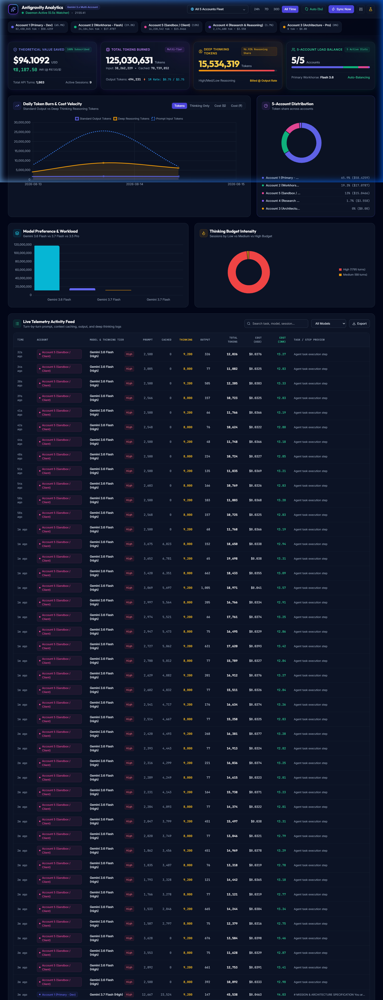
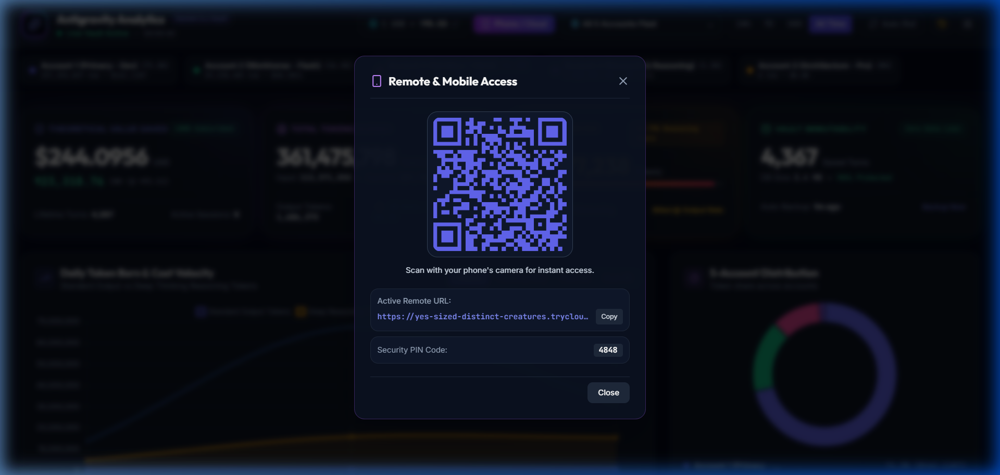
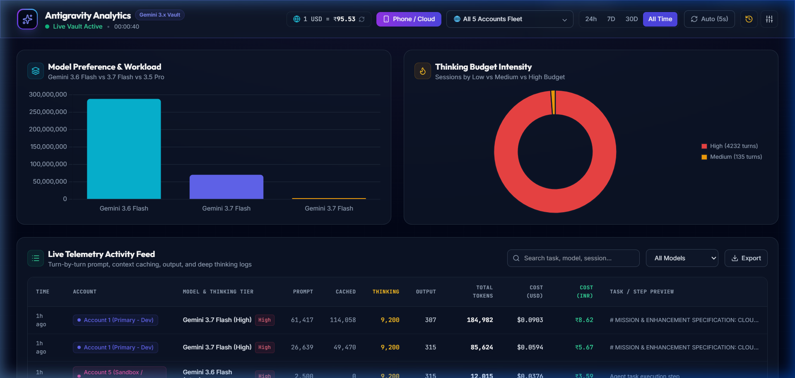
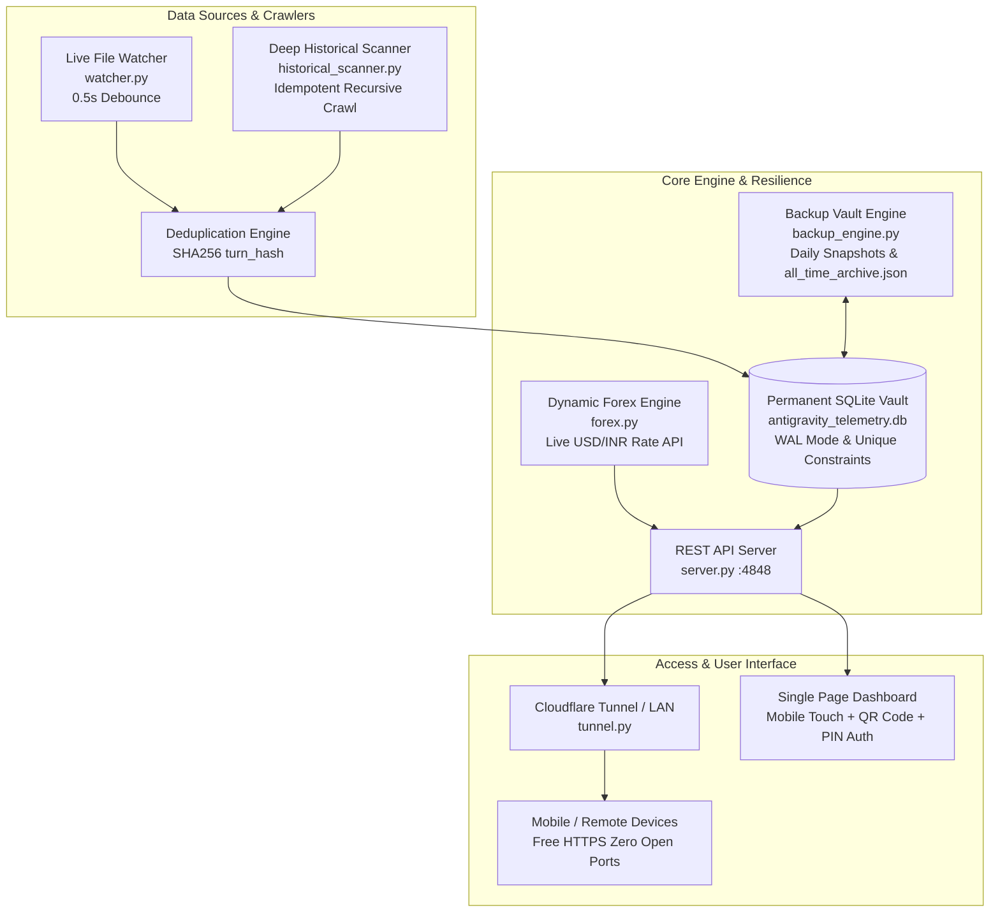

<p align="center">
  <br>
  <em><b>The 100% Local, Zero-Cost, Multi-Account Token & Cost Analytics Cloud Hub for Google Antigravity</b></em>
</p>

<p align="center">
  <a href="https://opensource.org/licenses/MIT"></a>
  <a href="https://www.python.org/"></a>
  <a href="https://deepmind.google/technologies/gemini/"></a>
  <a href="https://cloudflare.com"></a>
  
</p>

<p align="center">
  <b>Real-Time Telemetry Watcher</b> • <b>Deep Reasoning / Thinking Token Tracker</b> • <b>5-Account Fleet Load Balancer</b> • <b>Permanent Immutability Vault</b> • <b>Live Dynamic Forex</b> • <b>Free Mobile HTTPS Access</b>
</p>

---

<p align="center">
  
</p>

---

## 🌟 Highlights & Key Capabilities

<table>
  <tr>
    <td width="50%">
      <h3>📱 Remote & Mobile Multi-Device Access</h3>
      <ul>
        <li><b>Zero-Config Cloudflare Quick Tunnel:</b> Generates a free public HTTPS URL (<code>https://*.trycloudflare.com</code>) with zero open ports or port-forwarding.</li>
        <li><b>Scannable QR Code:</b> Instant smartphone camera pairing.</li>
        <li><b>PIN Security:</b> Built-in 4-digit PIN authentication (<code>4848</code>) to protect remote sessions while keeping localhost frictionless.</li>
      </ul>
    </td>
    <td width="50%">
      <h3>🧠 Deep Thinking & Reasoning Tokens</h3>
      <ul>
        <li><b>Internal Reasoning Isolation:</b> Explicitly isolates hidden thinking tokens generated under Low, Medium, and High thinking budgets.</li>
        <li><b>Official Pricing Math:</b> Applies official pay-as-you-go billing (Thinking tokens billed at Output rates).</li>
        <li><b>Visual Intensity Gauge:</b> Real-time reasoning share tracker.</li>
      </ul>
    </td>
  </tr>
  <tr>
    <td width="50%">
      <h3>🛡️ Permanent Data Immutability Vault</h3>
      <ul>
        <li><b>Decoupled Lifetime Storage:</b> Statistics <b>never reset or decrease</b>, even if <code>~/.gemini/</code> brain traces or temporary IDE files are wiped.</li>
        <li><b>SHA256 Deduplication:</b> Unique <code>turn_hash</code> prevents double-counting across restarts or deep scans.</li>
        <li><b>Automated Daily Backups:</b> Rolling 7-day SQLite snapshots & consolidated JSON archives in <code>~/.antigravity_analytics_vault/</code>.</li>
      </ul>
    </td>
    <td width="50%">
      <h3>👥 5-Account Automatic Fleet Tagging</h3>
      <ul>
        <li><b>Multi-Account Separation:</b> Automatically segregates telemetry across 5 distinct Gemini accounts on the same laptop.</li>
        <li><b>Load Balancer Donut:</b> Live load percentage & cost share per account.</li>
        <li><b>Customizable Aliases:</b> Custom names, email tags, and color badges.</li>
      </ul>
    </td>
  </tr>
</table>

---

## 📸 Screenshots & Visual Walkthrough

<div align="center">
  <table>
    <tr>
      <td width="50%" align="center">
        <b>📱 Mobile & Cloud Remote Access with QR Pairing</b><br><br>
        
      </td>
      <td width="50%" align="center">
        <b>📊 Live Activity Feed & Model Preference Share</b><br><br>
        
      </td>
    </tr>
  </table>
</div>

---

## ⚡ Quick Start Guide

### 🪟 Windows (Recommended — One-Click Silent Background Service)

Run without an open terminal window:
```cmd
start_all_background.bat
```
*(Runs the Analytics Server, Telemetry Watcher, Live Forex Engine, Backup Vault, and Cloudflare Tunnel silently in the background).*

- Open Web Dashboard: **[http://localhost:4848](http://localhost:4848)**
- To stop all background services: `stop_all.bat`

### 🪟 Windows (Interactive Terminal Mode)
```cmd
install_and_run.bat
```

### 🐧 Linux / 🍎 macOS
```bash
git clone https://github.com/rishwebb/antigravity-vault.git
cd antigravity-vault
chmod +x install_and_run.sh start_background.sh stop_all.sh
./install_and_run.sh
```

---

## 💎 Dynamic Pricing & Reasoning Token Formulas

Antigravity Vault tracks exact theoretical API costs and savings according to official Gemini pay-as-you-go pricing rates:

| Model Tier | Input Price / 1M | Standard Output / 1M | Thinking Tokens / 1M | Cached Context / 1M |
| :--- | :--- | :--- | :--- | :--- |
| **Gemini 3.7 Flash** | $0.75 | $3.75 | **$3.75** (Billed as Output) | $0.075 |
| **Gemini 3.6 Flash** (Workhorse) | $0.75 | $3.75 | **$3.75** (Billed as Output) | $0.075 |
| **Gemini 3.5 Pro** ($\le 200\text{k}$) | $2.00 | $12.00 | **$12.00** (Billed as Output) | $0.200 |
| **Gemini 3.5 Pro** ($> 200\text{k}$) | $4.00 | $18.00 | **$18.00** (Billed as Output) | $0.200 |
| **Dynamic Fallback** | Family Flash ($0.75) / Pro ($2.00) | Family Flash ($3.75) / Pro ($12.00) | Output rate | 10% of Input rate |

### Cost Calculation Formulas:
$$\text{Turn Output Tokens}_i = \text{Standard Output Tokens}_i + \text{Deep Thinking Tokens}_i$$

$$\text{Cost (USD)}_i = (\text{Input}_i \times \text{Rate}_{\text{in}}) + (\text{Turn Output}_i \times \text{Rate}_{\text{out}}) + (\text{Cached}_i \times \text{Rate}_{\text{cache}})$$

$$\text{Cost (INR)}_i = \text{Cost (USD)}_i \times \text{Live Forex Rate}$$

$$\text{Theoretical Value Saved} = \sum \text{Cost (USD)}_i - \$0.00 \quad \text{(Subscribed Tier)}$$

---

## 🔍 Deep Historical Discovery & Past Usage Recovery

Antigravity Vault includes a high-speed recursive crawler (`historical_scanner.py`) that searches:
- `~/.gemini/antigravity-ide/brain/` (including all orphaned UUID subdirectories)
- `~/.gemini/antigravity/`
- `%APPDATA%/Antigravity IDE/User/globalStorage/` & `workspaceStorage/` (`state.vscdb` SQLite databases)
- `%APPDATA%/Code/User/globalStorage/` & `workspaceStorage/`
- `%LOCALAPPDATA%/Temp/` (temporary session caches, crash dumps, and JSONL traces)

> [!TIP]
> Click the **`Deep Scan`** button in the dashboard top bar anytime to backfill and recover historical sessions. All records are deduplicated via SHA256 hashes.

---

## 🏗️ Architecture & Data Pipeline



---

## 🌐 Complete REST API Reference

The local server runs on `http://localhost:4848`:

| Endpoint | Method | Description |
| :--- | :--- | :--- |
| `/` | `GET` | Single-Page Dark-Mode Developer Dashboard. |
| `/api/summary` | `GET` | Total tokens, thinking tokens split, USD/INR spend, theoretical value saved. |
| `/api/accounts` | `GET` | 5-Account breakdown (tokens used, cost, thinking intensity, load percentage). |
| `/api/models` | `GET` | Model usage share (3.6 Flash vs 3.7 Flash vs 3.5 Pro) and thinking budgets. |
| `/api/timeline` | `GET` | Daily burn rate and spend velocity (`?range=7d\|30d\|all`). |
| `/api/recent-logs` | `GET` | Paginated live turn logs (`?limit=50&offset=0&model=...&search=...`). |
| `/api/tunnel` | `GET` | Active Cloudflare HTTPS URL, local LAN URL, and QR code SVG. |
| `/api/forex` | `GET` | Current live USD/INR exchange rate and timestamp. |
| `/api/backup` | `GET` | Vault backup health status and snapshot list. |
| `/api/auth/status` | `GET` | Checks if current client session is authorized. |
| `/api/status` | `GET` | Watcher daemon health check, uptime, memory, and database size. |
| `/api/auth/verify` | `POST` | Validates 4-digit PIN and issues signed session cookie. |
| `/api/historical-scan` | `POST` | Triggers a deep historical crawl across all storage roots. |
| `/api/forex/refresh` | `POST` | Forces immediate live exchange rate fetch from public API. |
| `/api/backup/create` | `POST` | Triggers point-in-time SQLite snapshot & JSON archive. |
| `/api/sync` | `POST` | Triggers immediate rescan of active session transcripts. |
| `/api/accounts/update`| `POST` | Updates custom account alias or color badge. |
| `/api/settings` | `POST` | Updates custom configuration keys. |

---

## 🔒 Security & Privacy

- **100% Local & Self-Hosted:** All database files, session metadata, and token calculations remain strictly on your machine in `antigravity_telemetry.db`.
- **Zero Cloud Tracking:** No telemetry, source code, or credentials are sent to third parties.
- **PIN Protected Remote Access:** When accessing via Cloudflare Quick Tunnel or LAN, users must enter a 4-digit PIN (`4848`, customizable via `ANTIGRAVITY_PIN` or `config.py`).

---

## 📁 Repository Structure

```
antigravity-vault/
├── config.py                 # Pricing engine, vault paths, PIN security
├── db.py                     # Thread-safe SQLite schema, WAL mode, SHA256 deduplication
├── historical_scanner.py     # Deep historical crawler & legacy session recovery
├── forex.py                  # Live USD/INR rate fetcher with offline cache
├── backup_engine.py          # Daily automated SQLite snapshots & all_time_archive.json
├── tunnel.py                 # Cloudflare Quick Tunnel & LAN QR code manager
├── telemetry_parser.py       # Real-time session and thinking-token parser
├── parser.py                 # Module wrapper
├── watcher.py                # 500ms debounced background file watcher daemon
├── server.py                 # Multi-threaded REST API server & static asset handler
├── templates/
│   └── index.html            # Mobile-first dark-mode developer dashboard
├── docs/
│   └── images/               # High-res dashboard screenshots
├── start_all_background.bat  # Silent Windows background launcher
├── start_all_background.vbs  # Invisible VBScript runner (no popups)
├── stop_all.bat              # Complete Windows process terminator
├── stop_all.sh               # Complete Linux/macOS process terminator
├── install_and_run.bat       # Interactive Windows launcher
├── install_and_run.sh        # Interactive Linux/macOS launcher
├── requirements.txt          # Optional dependencies (100% works with standard library)
├── COMPLETE_SYSTEM_EXPLANATION.md # Detailed technical architecture manual
├── CONTRIBUTING.md           # Contribution guidelines
├── LICENSE                   # MIT License
└── README.md                 # Project README
```

---

## 🤝 Contributing

Contributions, issues, and feature requests are welcome! Feel free to check the [issues page](https://github.com/rishwebb/antigravity-vault/issues). See [`CONTRIBUTING.md`](CONTRIBUTING.md) for setup details.

---

## 📄 License

This project is licensed under the [MIT License](LICENSE) - Copyright (c) 2026 rishwebb / Antigravity Vault Contributors.

<div align="center">
  <sub>Built with ❤️ for the Antigravity & Gemini developer community.</sub>
</div>
