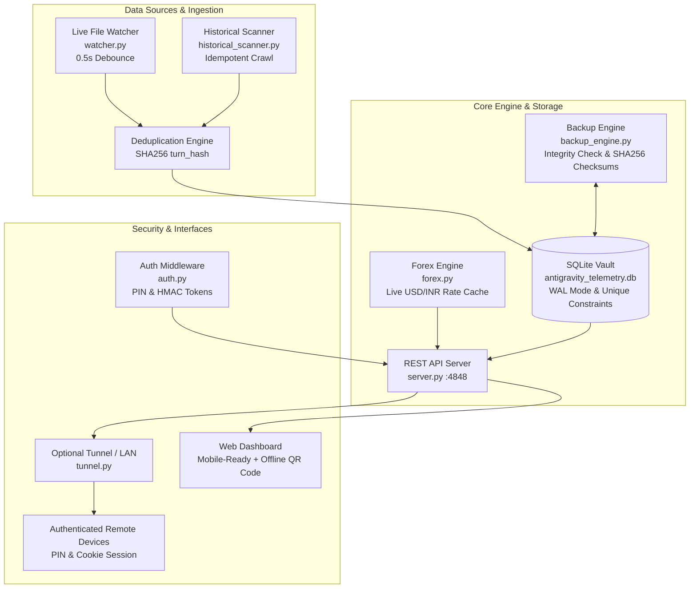

<p align="center">
  <br>
  <em><b>The Local, Multi-Account Token & Cost Analytics Hub for Google Antigravity</b></em>
</p>

<p align="center">
  <a href="https://opensource.org/licenses/MIT"></a>
  <a href="https://www.python.org/"></a>
  <a href="https://deepmind.google/technologies/gemini/"></a>
  <a href="https://cloudflare.com"></a>
  
</p>

<p align="center">
  <b>Real-Time Telemetry Watcher</b> • <b>Deep Reasoning / Thinking Token Tracker</b> • <b>Multi-Account Fleet Balancer</b> • <b>Persistent Storage Vault</b> • <b>Dynamic Forex</b> • <b>Local & Remote Access</b>
</p>

---

<p align="center">
  
</p>

---

## 🌟 Highlights & Key Capabilities

<table>
  <tr>
    <td width="50%">
      <h3>📱 Local LAN & Remote Access</h3>
      <ul>
        <li><b>Localhost-First Security:</b> Binds securely to <code>127.0.0.1</code> by default with zero unauthorized network exposure.</li>
        <li><b>100% Offline SVG QR Pairing:</b> Pure-Python offline QR generator; zero data is sent to external QR servers.</li>
        <li><b>Dynamic PIN Protection:</b> High-entropy auto-generated PIN and HMAC session tokens protect remote access.</li>
      </ul>
    </td>
    <td width="50%">
      <h3>🧠 Deep Thinking & Reasoning Tokens</h3>
      <ul>
        <li><b>Internal Reasoning Isolation:</b> Explicitly isolates thinking tokens from <code>&lt;thought&gt;</code> tags and reasoning budgets.</li>
        <li><b>Official Pricing Math:</b> Applies official pay-as-you-go billing rates (Thinking tokens billed at Output rates).</li>
        <li><b>Transparent Metrics:</b> Explicit data provenance tags distinguish exact, extracted, and heuristic estimates.</li>
      </ul>
    </td>
  </tr>
  <tr>
    <td width="50%">
      <h3>🛡️ Persistent Data Vault</h3>
      <ul>
        <li><b>Decoupled Lifetime Storage:</b> Statistics persist locally even if temporary IDE caches or transcripts are rotated.</li>
        <li><b>SHA256 Deduplication:</b> Unique <code>turn_hash</code> prevents double-counting across restarts or scans.</li>
        <li><b>Automated Daily Backups:</b> Rolling 7-day SQLite snapshots with PRAGMA integrity verification and SHA256 checksums.</li>
      </ul>
    </td>
    <td width="50%">
      <h3>👥 Multi-Account Fleet Tagging</h3>
      <ul>
        <li><b>Multi-Account Segregation:</b> Automatically tags and groups sessions across distinct accounts or workspaces.</li>
        <li><b>Load Balancer Donut:</b> Live load percentage & estimated cost share per account.</li>
        <li><b>Customizable Aliases:</b> Custom names, email tags, and color badges.</li>
      </ul>
    </td>
  </tr>
</table>

---

## ⚡ Quick Start Guide

### 🪟 Windows (Recommended — One-Click Silent Background Service)

Run without an open terminal window:
```cmd
start_all_background.bat
```
*(Runs the Analytics Server, Telemetry Watcher, Live Forex Engine, and Backup Vault silently in the background).*

- Open Web Dashboard: **[http://localhost:4848](http://localhost:4848)**
- To stop all background services: `stop_all.bat`

### 🪟 Windows (Interactive Terminal Mode)
```cmd
install_and_run.bat
```

### 🐧 Linux / 🍎 macOS
```bash
git clone https://github.com/rishwebb/antigravity-vault.git
cd antigravity-vault
chmod +x install_and_run.sh start_background.sh stop_all.sh
./install_and_run.sh
```

---

## 💎 Dynamic Pricing & Reasoning Token Formulas

Antigravity Vault tracks estimated API costs and equivalent value according to official Gemini pay-as-you-go pricing rates:

| Model Tier | Input Price / 1M | Standard Output / 1M | Thinking Tokens / 1M | Cached Context / 1M |
| :--- | :--- | :--- | :--- | :--- |
| **Gemini 3.7 Flash** | $0.75 | $3.75 | **$3.75** (Billed as Output) | $0.075 |
| **Gemini 3.6 Flash** (Workhorse) | $0.75 | $3.75 | **$3.75** (Billed as Output) | $0.075 |
| **Gemini 3.5 Pro** ($\le 200\text{k}$) | $2.00 | $12.00 | **$12.00** (Billed as Output) | $0.200 |
| **Gemini 3.5 Pro** ($> 200\text{k}$) | $4.00 | $18.00 | **$18.00** (Billed as Output) | $0.200 |
| **Dynamic Fallback** | Family Flash ($0.75) / Pro ($2.00) | Family Flash ($3.75) / Pro ($12.00) | Output rate | 10% of Input rate |

### Cost Calculation Formulas:
$$\text{Turn Output Tokens}_i = \text{Standard Output Tokens}_i + \text{Deep Thinking Tokens}_i$$

$$\text{Estimated Cost (USD)}_i = (\text{Input}_i \times \text{Rate}_{\text{in}}) + (\text{Turn Output}_i \times \text{Rate}_{\text{out}}) + (\text{Cached}_i \times \text{Rate}_{\text{cache}})$$

$$\text{Estimated Cost (INR)}_i = \text{Cost (USD)}_i \times \text{Live Forex Rate}$$

$$\text{Equivalent Plan Value} = \sum \text{Estimated Cost (USD)}_i$$

> [!NOTE]
> Token counts are calculated using high-speed character-length heuristic modeling (~3.8 chars/tok) and extracted XML thought blocks. All values in the API and UI are explicitly tagged with `cost_is_estimated: true`.

---

## 🔍 Historical Discovery & Past Usage Recovery

Antigravity Vault includes a recursive scanner (`historical_scanner.py`) that searches:
- `~/.gemini/antigravity-ide/brain/` (including all orphaned UUID subdirectories)
- `~/.gemini/antigravity/`
- `%APPDATA%/Antigravity IDE/User/globalStorage/` & `workspaceStorage/` (`state.vscdb` SQLite databases)
- `%APPDATA%/Code/User/globalStorage/` & `workspaceStorage/`
- `%LOCALAPPDATA%/Temp/` (temporary session caches, crash dumps, and JSONL traces)

> [!TIP]
> Click the **`Deep Scan`** button in the dashboard top bar anytime to backfill and recover historical sessions. Recovered fragments are explicitly tagged as `data_source: 'vscdb_trace'` or `data_source: 'historical_scan'`.

---

## 🏗️ Architecture & Data Pipeline



---

## 🌐 REST API Reference

The server binds to `http://127.0.0.1:4848`:

| Endpoint | Method | Auth | Description |
| :--- | :--- | :--- | :--- |
| `/` | `GET` | Public | Single-Page Dark-Mode Developer Dashboard. |
| `/api/auth/status` | `GET` | Public | Checks client authorization and lockout status. |
| `/api/auth/verify` | `POST` | Public | Validates PIN with rate-limiting and issues signed session token. |
| `/api/summary` | `GET` | **Protected** | Lifetime tokens, thinking tokens split, USD/INR spend estimates. |
| `/api/accounts` | `GET` | **Protected** | Multi-account breakdown (tokens, cost, thinking intensity, load %). |
| `/api/models` | `GET` | **Protected** | Model usage share (3.6 Flash vs 3.7 Flash vs 3.5 Pro) and budgets. |
| `/api/timeline` | `GET` | **Protected** | Daily burn rate and spend velocity (`?range=7d\|30d\|all`). |
| `/api/recent-logs` | `GET` | **Protected** | Paginated live turn logs with path sanitization. |
| `/api/tunnel` | `GET` | **Protected** | Active remote URL, local LAN URL, and offline QR code SVG. |
| `/api/forex` | `GET` | **Protected** | Current live USD/INR exchange rate and timestamp. |
| `/api/backup` | `GET` | **Protected** | Vault backup health status, checksums, and snapshot list. |
| `/api/status` | `GET` | **Protected** | Watcher metrics, uptime, database size, and integrity. |
| `/api/status/audit-log` | `GET` | **Protected** | Security access audit trail (login successes and failures). |
| `/api/status/errors` | `GET` | **Protected** | Recent system and parser error logs for observability. |
| `/api/historical-scan` | `POST` | **Protected** | Triggers deep historical crawl across all storage roots. |
| `/api/backup/create` | `POST` | **Protected** | Triggers verified SQLite snapshot & JSON archive. |
| `/api/backup/verify` | `POST` | **Protected** | Runs dry-run restore and SQLite PRAGMA integrity check. |
| `/api/sync` | `POST` | **Protected** | Triggers immediate rescan of active session transcripts. |

---

## 🔒 Security & Privacy

- **Localhost Binding by Default:** Server binds to `127.0.0.1` unless explicitly configured.
- **Dynamic PIN & Secret Generation:** High-entropy security credentials are automatically generated and saved to `~/.antigravity_analytics_vault/.auth_credentials.json` on first run.
- **100% Offline QR Generation:** QR codes are rendered locally via pure-Python vector SVGs; no data is ever sent to third-party QR generation APIs.
- **Audit Logging:** Failed access attempts and security events are recorded in `auth_audit_logs`.
- **Brute-Force Rate Limiting:** 5 failed attempts trigger an automatic 5-minute cooldown.

---

## 📁 Repository Structure

```
antigravity-vault/
├── auth.py                   # Dynamic security PIN, HMAC token signing, rate limiting & middleware
├── pricing_engine.py         # Model pricing tiers, token estimation & billing calculations
├── logger.py                 # Centralized structured logging & observability error tracking
├── qr_generator.py           # 100% offline pure-Python SVG QR code generator
├── config.py                 # Vault paths, discovery roots & configuration settings
├── db.py                     # Thread-safe SQLite schema, WAL mode, migrations & audit logs
├── historical_scanner.py     # Historical crawler & legacy session recovery
├── forex.py                  # Live USD/INR rate fetcher with offline cache
├── backup_engine.py          # Daily automated SQLite snapshots, integrity check & checksums
├── tunnel.py                 # Opt-in Cloudflare Quick Tunnel & LAN pairing manager
├── telemetry_parser.py       # Real-time session and thinking-token parser
├── watcher.py                # 500ms debounced background file watcher daemon
├── server.py                 # Multi-threaded REST API server with auth middleware
├── templates/
│   └── index.html            # Mobile-first dark-mode developer dashboard
├── tests/                    # Comprehensive automated test suite
│   ├── test_pricing.py       # Pricing engine & token estimation tests
│   ├── test_dedup.py         # SHA256 deduplication & idempotency tests
│   ├── test_auth.py          # Authentication, token & rate-limiting tests
│   ├── test_db_and_backup.py # Database integrity & backup verification tests
│   ├── test_parser.py        # Telemetry parser resilience tests
│   └── test_offline_qr.py    # Offline SVG QR generator tests
├── test_endpoints.py         # REST API verification integration test
├── start_all_background.bat  # Silent Windows background launcher
├── start_all_background.vbs  # Invisible VBScript runner (no popups)
├── stop_all.bat              # Complete Windows process terminator
├── stop_all.sh               # Complete Linux/macOS process terminator
├── install_and_run.bat       # Interactive Windows launcher
├── install_and_run.sh        # Interactive Linux/macOS launcher
├── requirements.txt          # Optional dependencies (100% works with standard library)
├── COMPLETE_SYSTEM_EXPLANATION.md # Detailed technical architecture manual
├── CONTRIBUTING.md           # Contribution guidelines
├── LICENSE                   # MIT License
└── README.md                 # Project README
```

---

## 📄 License

This project is licensed under the [MIT License](LICENSE) - Copyright (c) 2026 rishwebb / Antigravity Vault Contributors.
